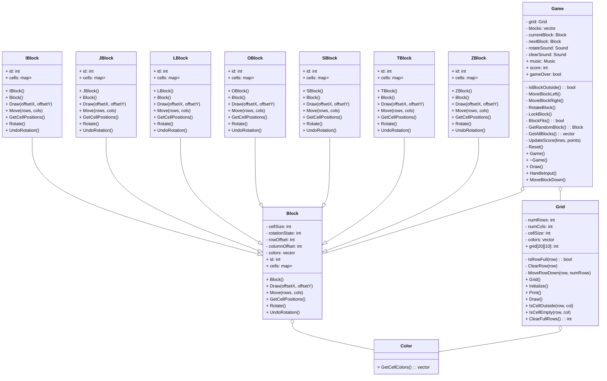

```mermaid
classDiagram
        IBlock --|> Block
        JBlock --|> Block
        LBlock --|> Block
        OBlock --|> Block
        SBlock --|> Block
        TBlock --|> Block
        ZBlock --|> Block
        Game o-- Grid
        Game o-- Block
        Block o-- Color
        Grid o-- Color
        class Grid {
            - numRows: int                   
            - numCols: int                   
            - cellSize: int                  
            - colors: vector<Color>   
            - IsRowFull(row): bool
            - ClearRow(row)
            - MoveRowDown(row, numRows)

            + grid[20][10]: int 
            + Grid()
            + Initialize()                   
            + Print()                        
            + Draw()                         
            + IsCellOutside(row, col)        
            + IsCellEmpty(row, col)          
            + ClearFullRows(): int  
        }
        class Game {
            - grid: Grid                      
            - blocks: vector<Block>          
            - currentBlock: Block            
            - nextBlock: Block               
            - rotateSound: Sound             
            - clearSound: Sound              
            - IsBlockOutside(): bool
            - MoveBlockLeft()                
            - MoveBlockRight()               
            - RotateBlock()                  
            - LockBlock()                    
            - BlockFits(): bool              
            - GetRandomBlock(): Block        
            - GetAllBlocks(): vector<Block>  
            - UpdateScore(lines, points)     
            - Reset() 

            + music: Music                   
            + score: int                     
            + gameOver: bool     
            + Game()
            + ~Game()            
            + Draw()                         
            + HandleInput()                  
            + MoveBlockDown()                
        }
        class Color{
            + GetCellColors(): vector<Color> 
        }
        class Block{
            - cellSize: int                  
            - rotationState: int             
            - rowOffset: int                 
            - columnOffset: int              
            - colors: vector<Color>  

            + id: int                         
            + cells: map<int, vector<Position>>   
            + Block()      
            + Draw(offsetX, offsetY)         
            + Move(rows, cols)               
            + GetCellPositions()             
            + Rotate()                       
            + UndoRotation() 
        }
        class IBlock{
            + IBlock()
            + id: int                         
            + cells: map<int, vector<Position>>   
            + Block()      
            + Draw(offsetX, offsetY)         
            + Move(rows, cols)               
            + GetCellPositions()             
            + Rotate()                       
            + UndoRotation() 
        }
        class JBlock{
            + JBlock()
            + id: int                         
            + cells: map<int, vector<Position>>   
            + Block()      
            + Draw(offsetX, offsetY)         
            + Move(rows, cols)               
            + GetCellPositions()             
            + Rotate()                       
            + UndoRotation() 
        }   
        class LBlock{
            + LBlock()
            + id: int                         
            + cells: map<int, vector<Position>>   
            + Block()      
            + Draw(offsetX, offsetY)         
            + Move(rows, cols)               
            + GetCellPositions()             
            + Rotate()                       
            + UndoRotation() 
        }
        class OBlock{
            + OBlock()
            + id: int                         
            + cells: map<int, vector<Position>>   
            + Block()      
            + Draw(offsetX, offsetY)         
            + Move(rows, cols)               
            + GetCellPositions()             
            + Rotate()                       
            + UndoRotation() 
        }
        class SBlock{
            + SBlock()
            + id: int                         
            + cells: map<int, vector<Position>>   
            + Block()      
            + Draw(offsetX, offsetY)         
            + Move(rows, cols)               
            + GetCellPositions()             
            + Rotate()                       
            + UndoRotation() 
        }
        class TBlock{
            + TBlock()
            + id: int                         
            + cells: map<int, vector<Position>>   
            + Block()      
            + Draw(offsetX, offsetY)         
            + Move(rows, cols)               
            + GetCellPositions()             
            + Rotate()                       
            + UndoRotation() 
        }
        class ZBlock{
            + ZBlock()
            + id: int                         
            + cells: map<int, vector<Position>>   
            + Block()      
            + Draw(offsetX, offsetY)         
            + Move(rows, cols)               
            + GetCellPositions()             
            + Rotate()                       
            + UndoRotation() 
        }
      
```
